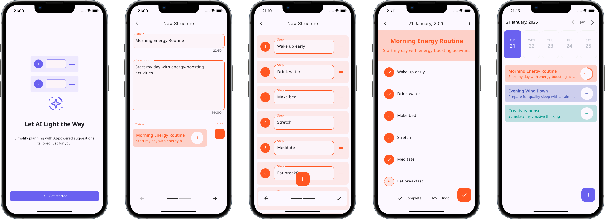

# Happy

![coverage][coverage_badge]
[![style: very good analysis][very_good_analysis_badge]][very_good_analysis_link]
[![License: Apache-2.0][license_badge]][license_link]

Happy is an AI-powered structured day planner designed for productivity.

Core features:

- Daily tasks and routines steps generation by integrating Vertex AI
- Daily tracking for consistency and routines creation
- Progress monitoring to build habits and achieve goals

</br></br>

## Getting Started 🚀

This project contains 3 flavors:

- development
- staging
- production

Before you run the app you must add projects "happy-day-dev", "happy-day-stg", and "happy-day-prod" to your Firebase console.

Now, install Firebase & FlutterFire CLI and configure projects for each flavor:

```sh
# Install CLI
npm install -g firebase-tools
dart pub global activate flutterfire_cli

# Login to Firebase
firebase login

# Get projects configuration
./flutterfire_config.sh dev
./flutterfire_config.sh stg
./flutterfire_config.sh prod
```

To run the desired flavor either use the launch configuration in VSCode/Android Studio or use the following commands:

```sh
# Development
$ flutter run --flavor development --target lib/main_development.dart

# Staging
$ flutter run --flavor staging --target lib/main_staging.dart

# Production
$ flutter run --flavor production --target lib/main_production.dart
```

_\*Happy works on iOS, Android, and Web._

### Troubleshooting

If you are getting an error that says "Failed to list Firebase projects error", run `firebase logout`, then `firebase login`, and try again.

---

## Running Tests 🧪

To run all unit and widget tests use the following command:

```sh
$ flutter test --coverage --test-randomize-ordering-seed random
```

To view the generated coverage report you can use [lcov](https://github.com/linux-test-project/lcov).

```sh
# Generate Coverage Report
$ genhtml coverage/lcov.info -o coverage/

# Open Coverage Report
$ open coverage/index.html
```

---

## Working with Translations 🌐

This project relies on [flutter_localizations][flutter_localizations_link] and follows the [official internationalization guide for Flutter][internationalization_link].

### Adding Strings

1. To add a new localizable string, open the `app_en.arb` file at `lib/l10n/arb/app_en.arb`.

```arb
{
    "@@locale": "en",
    "counterAppBarTitle": "Counter",
    "@counterAppBarTitle": {
        "description": "Text shown in the AppBar of the Counter Page"
    }
}
```

2. Then add a new key/value and description

```arb
{
    "@@locale": "en",
    "counterAppBarTitle": "Counter",
    "@counterAppBarTitle": {
        "description": "Text shown in the AppBar of the Counter Page"
    },
    "helloWorld": "Hello World",
    "@helloWorld": {
        "description": "Hello World Text"
    }
}
```

3. Use the new string

```dart
import 'package:happy_day/l10n/l10n.dart';

@override
Widget build(BuildContext context) {
  final l10n = context.l10n;
  return Text(l10n.helloWorld);
}
```

### Adding Supported Locales

Update the `CFBundleLocalizations` array in the `Info.plist` at `ios/Runner/Info.plist` to include the new locale.

```xml
    ...

    <key>CFBundleLocalizations</key>
	<array>
		<string>en</string>
		<string>es</string>
	</array>

    ...
```

### Adding Translations

1. For each supported locale, add a new ARB file in `lib/l10n/arb`.

```
├── l10n
│   ├── arb
│   │   ├── app_en.arb
│   │   └── app_es.arb
```

2. Add the translated strings to each `.arb` file:

`app_en.arb`

```arb
{
    "@@locale": "en",
    "counterAppBarTitle": "Counter",
    "@counterAppBarTitle": {
        "description": "Text shown in the AppBar of the Counter Page"
    }
}
```

`app_es.arb`

```arb
{
    "@@locale": "es",
    "counterAppBarTitle": "Contador",
    "@counterAppBarTitle": {
        "description": "Texto mostrado en la AppBar de la página del contador"
    }
}
```

### Generating Translations

To use the latest translations changes, you will need to generate them:

1. Generate localizations for the current project:

```sh
flutter gen-l10n --arb-dir="lib/l10n/arb"
```

Alternatively, run `flutter run` and code generation will take place automatically.

---

## Project Summary 🧑‍💻

Happy Day is an AI-powered structured day planner built with Flutter. It helps users manage daily structures (routines/tasks) and increase productivity. The application uses Flutter's bloc pattern for state management and follows modern architecture patterns.

### Key Features
- Daily structures management (routines/tasks)
- AI-assisted step generation (using Vertex AI)
- Dark mode support
- Multi-language support

### Technical Architecture
- **State Management**: Uses `flutter_bloc` with both Cubit and Bloc classes
- **Immutability**: Uses `freezed` for creating immutable state classes
- **Navigation**: Implements `go_router` for routing
- **Storage**: Uses repository pattern with local storage
- **Theming**: Supports both light and dark themes with dynamic switching
- **Error Handling**: Uses `flutter_fimber` for logging
- **Notifications**: Uses `toastification` for user feedback
- **Localization**: Supports multiple languages (English, German, Spanish, Polish)
- **Firebase Integration**: Analytics, Crashlytics, and Vertex AI

### Detailed Implementation Examples

#### 1. Flavors Implementation

Happy Day uses Flutter flavors to manage different environments (development, staging, production). Each flavor has its own entry point and configuration.

**Main Entry Point Example (`main_development.dart`):**
```dart
import 'package:firebase_core/firebase_core.dart';
import 'package:flutter/material.dart';
import 'package:flutter_bloc/flutter_bloc.dart';
import 'package:flutter_fimber/flutter_fimber.dart';
import 'package:happy_day/bootstrap.dart';
import 'package:happy_day/firebase_options_dev.dart';
import 'package:happy_day/shared/logging.dart';
import 'package:local_storage_structures_api/local_storage_structures_api.dart';
import 'package:onboarding_repository/onboarding_repository.dart';
import 'package:shared_preferences/shared_preferences.dart';
import 'package:steps_generation_repository/steps_generation_repository.dart';

Future<void> main() async {
  WidgetsFlutterBinding.ensureInitialized();

  final sharedPreferences = await SharedPreferences.getInstance();

  final onboardingRepository = OnboardingRepository(
    sharedPreferences: sharedPreferences,
  );

  final structuresApi = LocalStorageStructuresApi(
    plugin: sharedPreferences,
  );

  Bloc.observer = const LoggingBlocObserver();

  final logTree = DebugTree(
    logLevels: DebugTree.defaultLevels.toList()..add('V'),
    useColors: true,
  );

  await Firebase.initializeApp(options: DefaultFirebaseOptions.currentPlatform);

  const stepsGenerationRepository = FakeStepsGenerationRepository();

  return bootstrap(
    structuresApi: structuresApi,
    stepsGenerationRepository: stepsGenerationRepository,
    onboardingRepository: onboardingRepository,
    onFatalError: (details) {
      Fimber.e(details.exceptionAsString(), stacktrace: details.stack);
    },
    onError: (error, stackTrace) {
      Fimber.e(error.toString(), stacktrace: stackTrace);
    },
    logTree: logTree,
    sendCrashlyticsReports: false,
  );
}
```

**Bootstrap Function:**
```dart
Future<void> bootstrap({
  required StructuresApi structuresApi,
  required StepsGenerationRepository stepsGenerationRepository,
  required OnboardingRepository onboardingRepository,
  required void Function(FlutterErrorDetails) onFatalError,
  required void Function(Object, StackTrace) onError,
  required LogTree logTree,
  required bool sendCrashlyticsReports,
}) async {
  FlutterError.onError = onFatalError;

  PlatformDispatcher.instance.onError = (error, stack) {
    onError(error, stack);
    return true;
  };

  Fimber.plantTree(logTree);

  final structuresRepository =
      StructuresRepository(structuresApi: structuresApi);
  const emailRepository = EmailRepository();

  if (sendCrashlyticsReports) {
    await FirebaseCrashlytics.instance.setCrashlyticsCollectionEnabled(true);
  }

  const wiredashProjectId = String.fromEnvironment('WIREDASH_PROJECT_ID');
  const wiredashSecret = String.fromEnvironment('WIREDASH_SECRET');

  HydratedBloc.storage = await HydratedStorage.build(
    storageDirectory: kIsWeb
        ? HydratedStorageDirectory.web
        : HydratedStorageDirectory((await getTemporaryDirectory()).path),
  );

  runApp(
    Wiredash(
      projectId: wiredashProjectId,
      secret: wiredashSecret,
      child: App(
        structuresRepository: structuresRepository,
        stepsGenerationRepository: stepsGenerationRepository,
        onboardingRepository: onboardingRepository,
        emailRepository: emailRepository,
      ),
    ),
  );
}
```

#### 2. Repository Pattern Implementation

The app follows the repository pattern to provide a clean abstraction layer over the data sources. Here's an example from the `EditStructureBloc`:

```dart
class EditStructureBloc extends Bloc<EditStructureEvent, EditStructureState> {
  EditStructureBloc({
    required StructuresRepository structuresRepository,
    required StepsGenerationRepository stepsGenerationRepository,
    required Structure? initialStructure,
    String? languageCode,
  })  : _structuresRepository = structuresRepository,
        _stepsGenerationRepository = stepsGenerationRepository,
        super(
          EditStructureState(
            // Initial state setup with data from repository
            structureId: initialStructure?.id ?? Structure.newId,
            initialStructure: initialStructure,
            title: initialStructure?.title ?? '',
            description: initialStructure?.description ?? '',
            color: initialStructure != null
                ? initialStructure.color
                : Colors.deepPurple,
            steps: initialStructure != null
                ? structuresRepository.getSteps(initialStructure.id)
                : [],
            languageCode: languageCode ?? 'en',
            weekDays: initialStructure != null
                ? initialStructure.weekDays
                : [true, true, true, true, true, false, false],
          ),
        ) {
    // Event handlers
  }

  final StructuresRepository _structuresRepository;
  final StepsGenerationRepository _stepsGenerationRepository;
  
  // Example of repository method usage
  Future<void> _onSubmitted(Emitter<EditStructureState> emit) async {
    emit(state.copyWith(editStatus: EditStructureStatus.loading));

    final structure = (state.initialStructure ?? Structure.empty()).copyWith(
      id: state.structureId,
      title: state.title,
      description: state.description,
      // More fields...
    );

    try {
      await _structuresRepository.saveStructure(structure, state.steps);
      emit(state.copyWith(editStatus: EditStructureStatus.success));
    } catch (error, stackTrace) {
      Fimber.e(
        'Failed to submit structure',
        ex: error,
        stacktrace: stackTrace,
      );
      emit(state.copyWith(editStatus: EditStructureStatus.failure));
    }
  }
}
```

#### 3. Routing Implementation with go_router

The app uses `go_router` for navigation with named routes and redirection logic:

**Router Configuration:**
```dart
final goRouter = GoRouter(
  initialLocation: '/${RoutesNames.onboarding}',
  redirect: redirectToOnboardingIfNotCompleted,
  routes: [
    _onboardingRoute,
    _dailyStructuresRoute,
    _structureDetailsRoute,
    _editStructureRoute,
    _settingsRoute,
  ],
);

FutureOr<String?> redirectToOnboardingIfNotCompleted(
  BuildContext context,
  GoRouterState state,
) {
  final isOnboardingCompleted =
      context.read<OnboardingCubit>().state.isCompleted;
  final isOnboardingRoute =
      state.matchedLocation == '/${RoutesNames.onboarding}';

  if (isOnboardingCompleted && isOnboardingRoute) {
    return '/${RoutesNames.dailyStructures}';
  }

  if (!isOnboardingCompleted && !isOnboardingRoute) {
    return '/${RoutesNames.onboarding}';
  }

  return null;
}
```

**Route Definition Example:**
```dart
final _editStructureRoute = GoRoute(
  name: RoutesNames.editStructure,
  path: '/${RoutesNames.editStructure}',
  builder: (context, state) => EditStructurePage(
    initialStructure: state.extra as Structure?,
  ),
);
```

#### 4. Wiredash for User Feedback

The app integrates Wiredash for gathering user feedback, which is crucial for analytics and understanding user needs:

**Wiredash Setup in Bootstrap:**
```dart
runApp(
  Wiredash(
    projectId: wiredashProjectId,
    secret: wiredashSecret,
    child: App(
      structuresRepository: structuresRepository,
      stepsGenerationRepository: stepsGenerationRepository,
      onboardingRepository: onboardingRepository,
      emailRepository: emailRepository,
    ),
  ),
);
```

**Feedback Button in Settings:**
```dart
ListTile(
  key: const Key('sendFeedback'),
  title: Text(l10n.sendFeedback),
  trailing: const Icon(Icons.feedback_outlined),
  onTap: () => Wiredash.of(context).show(inheritMaterialTheme: true),
),
```

#### 5. Error Reporting with Fimber and Crashlytics

The app uses Flutter Fimber for logging and Firebase Crashlytics for error reporting in production:

**LoggingBlocObserver:**
```dart
class LoggingBlocObserver extends BlocObserver {
  const LoggingBlocObserver();

  @override
  void onCreate(BlocBase<dynamic> bloc) {
    Fimber.v('Creating instance of ${bloc.runtimeType}');
    super.onCreate(bloc);
  }

  @override
  void onEvent(Bloc<dynamic, dynamic> bloc, Object? event) {
    Fimber.v(event.toString());
    super.onEvent(bloc, event);
  }

  @override
  void onChange(BlocBase<dynamic> bloc, Change<dynamic> change) {
    Fimber.v('${change.nextState}');
    super.onChange(bloc, change);
  }

  @override
  void onError(BlocBase<dynamic> bloc, Object error, StackTrace stackTrace) {
    Fimber.e(
      'Error in ${bloc.runtimeType}',
      ex: error,
      stacktrace: stackTrace,
    );
    super.onError(bloc, error, stackTrace);
  }

  @override
  void onClose(BlocBase<dynamic> bloc) {
    Fimber.v('Closing instance of ${bloc.runtimeType}');
    super.onClose(bloc);
  }
}
```

**CrashlyticsTree for Logging:**
```dart
class CrashlyticsTree extends LogTree {
  @override
  List<String> getLevels() => ['I', 'W', 'E'];

  @override
  void log(
    String level,
    String message, {
    String? tag,
    dynamic ex,
    StackTrace? stacktrace,
  }) {
    if (level == 'E') {
      FirebaseCrashlytics.instance.recordError(
        ex ?? message,
        stacktrace ?? _getCustomStackTrace(),
        reason: ex != null ? message : null,
      );
    } else {
      FirebaseCrashlytics.instance.log(message);
      if (ex != null || stacktrace != null) {
        FirebaseCrashlytics.instance
            .log('exception: $ex, stacktrace: $stacktrace');
      }
    }
  }
}
```

#### 6. Cubit & State Classes with Freezed

The app uses Freezed for immutable state management, combined with BLoC pattern:

**State Class Example:**
```dart
@freezed
class EditStructureState with _$EditStructureState {
  const factory EditStructureState({
    required String structureId,
    @Default(EditStructureStatus.initial) EditStructureStatus editStatus,
    @Default(StepsGenerationStatus.initial)
    StepsGenerationStatus stepsGenerationStatus,
    @Default(StructureDeletionStatus.initial)
    StructureDeletionStatus deletionStatus,
    @Default('en') String languageCode,
    Structure? initialStructure,
    @Default('') String title,
    @Default('') String description,
    @Default([]) List<StructureStep> steps,
    @Default(Colors.deepPurple) Color color,
    @Default([true, true, true, true, true, false, false]) List<bool> weekDays,
  }) = _EditStructureState;
}

extension EditStructureStateX on EditStructureState {
  bool get isNewStructure => initialStructure == null;
  bool get isTitleValid => title.isNotEmpty;
}
```

**Event Class with Freezed:**
```dart
@freezed
class EditStructureEvent with _$EditStructureEvent {
  const factory EditStructureEvent.submitted() = _Submitted;
  const factory EditStructureEvent.titleChanged(String title) = _TitleChanged;
  const factory EditStructureEvent.descriptionChanged(String description) =
      _DescriptionChanged;
  const factory EditStructureEvent.colorChanged(Color color) = _ColorChanged;
  // More events...
}

extension EditStructureEventX on EditStructureEvent {
  bool get isSubmitted => this is _Submitted;
  bool get isTitleChanged => this is _TitleChanged;
  bool get isDescriptionChanged => this is _DescriptionChanged;
  // More getters...
  
  String get title => (this as _TitleChanged).title;
  String get description => (this as _DescriptionChanged).description;
  // More field accessors...
}
```

This implementation with Freezed provides:
- Immutable state with copyWith functionality
- Type-safe pattern matching
- Extension methods for easier state checking and property access
- Generated equality and toString methods
- Reduced boilerplate code

The app demonstrates a well-structured Flutter application using modern state management techniques with BLoC/Cubit patterns, clean architecture principles, and proper error handling. It's designed to be maintainable, testable, and scalable for future features.

[coverage_badge]: coverage_badge.svg
[flutter_localizations_link]: https://api.flutter.dev/flutter/flutter_localizations/flutter_localizations-library.html
[internationalization_link]: https://flutter.dev/docs/development/accessibility-and-localization/internationalization
[license_badge]: https://img.shields.io/badge/License-Apache_2.0-blue.svg
[license_link]: https://opensource.org/licenses/Apache-2.0
[very_good_analysis_badge]: https://img.shields.io/badge/style-very_good_analysis-B22C89.svg
[very_good_analysis_link]: https://pub.dev/packages/very_good_analysis
[very_good_cli_link]: https://github.com/VeryGoodOpenSource/very_good_cli